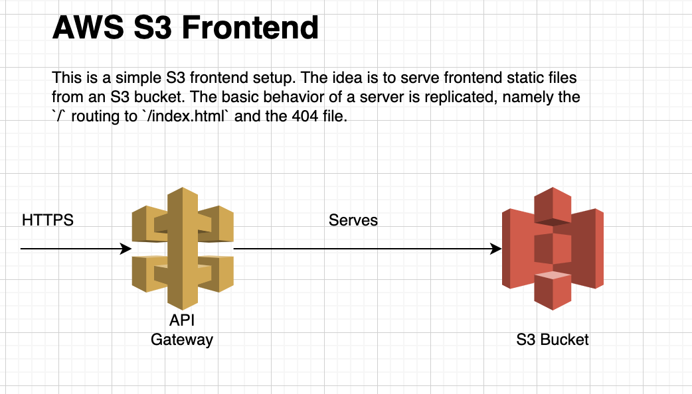

# S3 Frontend

#### A simple API Gateway directly serving files from an S3 bucket

The API is a connection from API Gateway to S3 that forwards all GET requests directly to the bucket. The response files get wrapped with all the required headers necessary to be useful in a browser. The React code in this project is built locally and then deployed using terraform.

## Quickstart
1. Pull down project
1. `npm i` and `npm run build`
1. `cd terraform` and `terraform init`
1. `terraform apply`
1. Find API Gateway and deploy the staged API
1. Use the API URL to curl `/hello` (mine looks like `curl https://bub5dm1qu9.execute-api.us-east-2.amazonaws.com/v1/index.html`)

